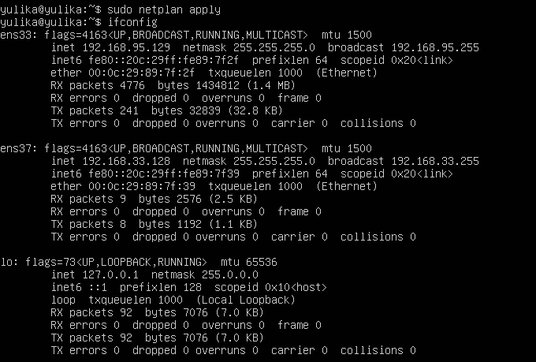

# 2022网络空间安全Linux实验报告chap01

## 实验环境
* VMware虚拟机软件 版本：16.2.2.20227
* 阿里云实验平台 系统：CentOs 版本：7.7.1908
* Linux虚拟机 系统：Ubuntu 64 版本:20.04
## 实验内容
* 调查并记录实验环境的如下信息

   * 当前 Linux 发行版基本信息
   * 当前 Linux 内核版本信息
* Virtualbox 安装完 Ubuntu 之后新添加的网卡如何实现系统开机自动启用和自动获取 IP？
*  如何使用 scp 在「虚拟机和宿主机之间」、「本机和远程 Linux 系统之间」传输文件？
* 如何配置 SSH 免密登录？

## 实验过程

### 一.调查并记录实验环境的如下信息

1.当前 Linux 发行版基本信息
* 方法一：输入如下代码
   ```
   lsb_release -a
   ```
   
* 方法二:输入如下代码
   ```
   cat /etc/lsb-release
   ```
   

2.当前 Linux 内核版本信息
* 方法1：
    ```
    cat /proc/version
    ```
    

* 方法2：
    ```
    uname -a
    ```
    

### 二.Virtualbox 安装完 Ubuntu 之后新添加的网卡如何实现系统开机自动启用和自动获取 IP？
* 在已有的NAT网络基础上，再添加新的网络适配器(Host-only)：


* 在虚拟机中，分别使用ifconfig和ifconfig -a查看使用中的网卡和所有网卡：


* 可以分析得出，ens37处于关闭状态，输入一下代码，打开相应的配置文件：
    ```
    sudo vim /etc/netplan/00-installer-config.yaml
    ```
    

* 将该配置文件修改如下：


* 使用代码`sudo netplan apply`应用修改,最终验证如下：


### 三.如何使用 scp 在「虚拟机和宿主机之间」、「本机和远程 Linux 系统之间」传输文件？
1.虚拟机和宿主机之间:
* 在桌面上创建tes.txt文件，并在Windows(宿主机)的cmd中通过如下代码传输到虚拟机上
    ```
    scp ./test.txt yulika@192.168.95.129:/home/yulika
    ```
    
* 在虚拟机上进行验证:
    
2.本机和远程Linux系统之间:
* 在阿里云开启远程服务，并在本机中通过scp命令，输入远程linux系统的弹性ip，将文件传输到远程linux系统：
    ```
    scp ./test.txt root@101.133.141.51:/root
    ```
    

* 在阿里云远程linux系统上验证：
    

### 如何配置 SSH 免密登录？
* 在宿主机上使用`ssh-keygen -t rsa`以rsa算法生成公私钥：


* 使用gitbash将公钥上传到虚拟机上:
    ```
    $ ssh-copy-id -i id_rsa.pub yulika@192.168.95.129
    ```
    

* 在虚拟机中查看公钥内容：
    ```
    vim ./.ssh/authorized_keys
    ```
    

* 免密登录设置完成：
