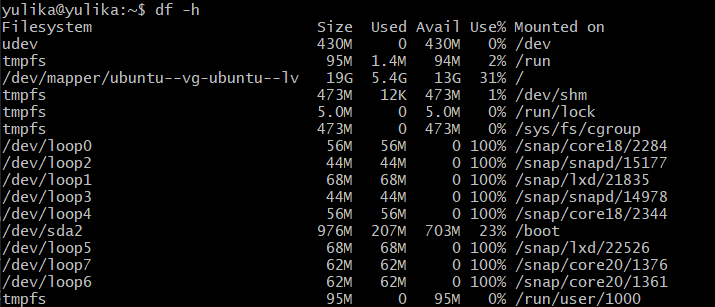
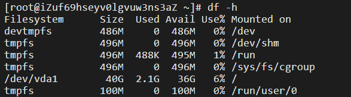

# 2022网络空间安全Linux实验报告chap02

## 实验环境
* VMware虚拟机软件 版本：16.2.2.20227
* 阿里云实验平台 系统：CentOs 版本：7.7.1908
* Linux虚拟机 系统：Ubuntu 64 版本:20.04

## 实验内容
### 【软件包管理】在目标发行版上安装 tmux 和 tshark ；查看这 2 个软件被安装到哪些路径；卸载 tshark ；验证 tshark 卸载结果
||ubuntu|CentOs|
| - | - | - |
|安装tmux|apt install tmux|yum install tmux|
|安装tshark|apt install tshark|yum whatprovides tshark <br>yum install wireshark|
|查看安装路径|dpkg -L (tmux/tshark)| rpm -qal \| grep (tmux/tshark)
|卸载tshark|apt remove tshark| yum remove wireshark
|验证tshark卸载结果|sudo apt policy tshark| rpm -qal \| grep tmux
* ubuntu
[](https://asciinema.org/a/ugOFx9ZEMGES3fwwTsdEYemhC)
* CentOs
[](https://asciinema.org/a/nDeONSNpYYdyORxpoKOP0ieGq)

    centos直接使用
    ``` 
    yum install tshark
    ```
    来安装tshark会显示如下信息
    ```
    Loaded plugins: fastestmirror
    Loading mirror speeds from cached hostfile
    No package tshark available.
    Error: Nothing to do
    ```
    这时，需要使用
    ```
    yum whatprovides tshark
    ```
    来搜索哪个包包含了tshark

### 【文件管理】复制以下 shell 代码到终端运行，在目标 Linux 发行版系统中构造测试数据集，然后回答以下问题：
```
cd /tmp && for i in $(seq 0 1024);do dir="test-$RANDOM";mkdir "$dir";echo "$RANDOM" > "$dir/$dir-$RANDOM";done
```
* 找到 /tmp 目录及其所有子目录下，文件名包含 666 的所有文件
* 找到 /tmp 目录及其所有子目录下，文件内容包含 666 的所有文件

| | ubuntu|centos| 
| - | - | - | 
|找到 /tmp 目录及其所有子目录下，文件名包含 666 的所有文件|find / -name +'*666*'|find / -name '*666*'|
|找到 /tmp 目录及其所有子目录下，文件内容包含 666 的所有文件|find / -name '*' \| xargs grep '666'|find /  \| xargs grep -ri "666"|

ubuntu:
[](https://asciinema.org/a/0lg1SA2dLSxluHpUhpmhfn6LJ)
CentOs:
[](https://asciinema.org/a/YpdrcrBDXMxGofjfRLoZw2uRD)

### 【文件压缩与解压缩】练习课件中 文件压缩与解压缩 一节所有提到的压缩与解压缩命令的使用方法
* ubuntu :
[](https://asciinema.org/a/9YdJyw2FD3WrES9SQlafLhn0O)

* centos:
[](https://asciinema.org/a/woIlXO0MIpmbUxTmdnG14IyIk)

### 子进程管理实验

* ubuntu:
[](https://asciinema.org/a/uJCrjXtFNphhP94d5XLPlcNQI)

* centos:
[](https://asciinema.org/a/AxzC8Ys2wvcve0S74KnEgkOf1)

### 目标系统的 CPU、内存大小、硬盘数量与硬盘容量
* ubuntu:
[](https://asciinema.org/a/zgW7EqJ00L09Fgd2HgrbP4lKM)
由`df -h`得到的硬盘信息如下:

* centos:
[](https://asciinema.org/a/tnCnAXZzR0t0VTH2HkBmB769P)
由`df -h`得到的硬盘信息如下:
