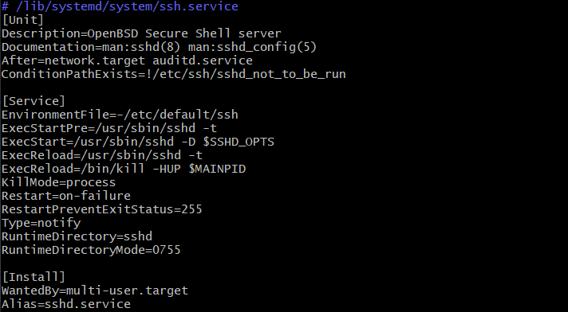
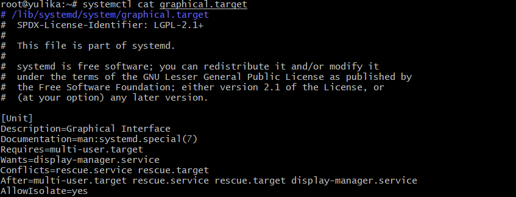
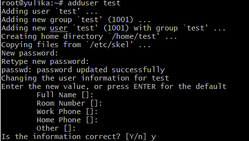
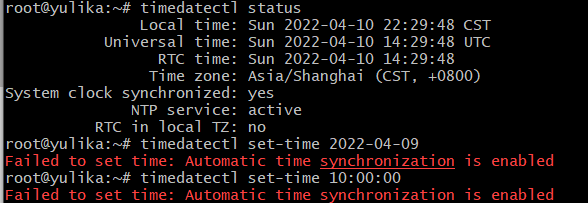

# 实验三

## 实验环境

* VMware虚拟机软件 版本：16.2.2.20227
* Linux虚拟机 系统：Ubuntu 64 版本:20.04

## 实验内容

* systemd入门教程:命令篇
  * systemd-analyze
    [](https://asciinema.org/a/EN7NbHIbiZMsFuwAm4kcp1nCY)
    
  * hostnamectl
     [](https://asciinema.org/a/lTbxHvpiS5gbDcoYEVapBwcmu)
     
  * localectl
    [](https://asciinema.org/a/BTLzfjVKWmnNtj8MJ9vj7AIj8)
    
  * timedatectl
     [](https://asciinema.org/a/o9z9K3cgNjRWwXTf5NsLE7kpE)
  
  * loginctl
     [](https://asciinema.org/a/zYDDFjCchrvSqzjRgwMlD02EQ)
  
  * Unit的配置文件的状态
     [](https://asciinema.org/a/diidQjguvqIs8qgh0dLwVuccU)
  
  * Target
     [](https://asciinema.org/a/gHPeOnTdGVyVpePeGcLkEkjjh)
  
  * 日志管理
     [](https://asciinema.org/a/SQQcP8zMeXpupTH7cyRy0ybvY)
  
     
  
* systemd入门教程:实战篇

  * 开机启动与启动服务
    [](https://asciinema.org/a/4lo570uiQoGuWz3NKLKT1CyMU)

  * 停止服务
    [](https://asciinema.org/a/b3uqPpZYEBkOHUVBoL6k6zBEa)

  * 启动顺序与依赖关系(以debug-shell.service为例)
    
    在Unit区块中不存在After和before字段，说明debug-shell不存在与其他unit的启动顺序，wants和requires字段缺省，表示debug-shell与其他unit不存在依赖关系

  * 启动行为、重启行为、install区块(以ssh.service为例)
    

    * EnvironmentFile=-/etc/default/ssh表示ssh.service的环境参数文件是/etc/default/ssh“-”符合表示在缺省/etc/default/ssh文件时也不会报错
    * ExecStart=/usr/sbin/sshd -D $SSHD_OPTS表示ssh启动执行的命令，其中$SSHD_OPTS即环境参数文件
    * Type指明ssh的启动类型是notify
    * KillMode表示停止ssh时，只会停止主进程，ssh的子进程不会受到影响
    * Restart=on-failure参数表示ssh非正常退出或信号终止和超时时，才会重启
    * WantedBy=multi-user.target表示ssh所在的Target是multi-user.target，当执行开机启动命令systemctl enable ssh.service，ssh.service的一个符号连接就会放在multi-user.target.wants的子目录中

  * target的配置文件(以graphical.target为例)

    

    * Require:graphical.target与multi-user.target一起运行
    * Conflicts:如果`rescue.service`或`rescue.target`正在运行，`graphical.target`就不能运行,反之亦然
    * After:表示graphical.target在multi-user.target、rescue.service、rescue.target 、display-manager.service之后启动
    * AllowIsolate`：允许使用`systemctl isolate`命令切换到`multi-user.target


## 自查清单

* #### 如何添加一个用户并使其具备sudo执行程序的权限？

  ```
  sudo adduser usr //添加用户
  sudo adduser usrname sudo//为用户添加sudo权限
  sudo usermod -a -G sudo usrname//将用户添加到sudo组里，即赋予用户sudo权限
  ```

  

  ```
  getent group sudo//显示带sudo权限的用户
  ```

  

* #### 如何将一个用户添加到一个用户组？

  ```
  sudo addgroup group//添加一个用户组
  sudo usermod -a -G group usrname//将一个用户添加进一个用户组
  groups usr//查询用户所在用户组
  ```

  

* #### 如何查看当前系统的分区表和文件系统详细信息？

  ```
  sudo fdisk -l//查询分区列表
  lsblk //文件系统详细信息
  ```

  分区列表：

  

  文件系统详细信息：

  

* #### 如何实现开机自动挂载VMware的共享目录分区？

  * 在本地创建测试文件

    

  * 在vmware中添加共享文件夹

    

    ```
    sudo mkdir /mnt/hgfs //在mnt目录下创建hgfs文件夹
    sudo vmhgfs-fuse /mnt/hgfs
    ls /mnt/hgfs //查找共享文件
    ```

    

  * 在/etc/fstab中添加一行代码,以实现开机自动挂载

    

  * 重启系统验证:

    

* #### 基于LVM（逻辑分卷管理）的分区如何实现动态扩容和缩减容量？

  * 在VMware选项中创建一个20G大小的新虚拟硬盘

    

  * 使用`sudo fdisk /dev/sdb`、`sudo fdisk /dev/sdc`对sdb、sdc磁盘进行分区处理，并将sdb3的extend类型转换成Linux类型

    

  * 对sdb创建pv和vg
    

  * 对sdc创建pv并加入到相同的vg中
    

  * 创建一个10G大小的lv
    

  * 将剩余的vg容量都分配给lv
    

  * 创建文件系统并挂载到指定目录
    

* #### 如何通过 systemd 设置实现在网络连通时运行一个指定脚本，在网络断开时运行另一个脚本？

  * 在`/etc/systemd/system`目录下创建一个test.service文件，并写入一下代码

    ```
    [Unit]
    Description=start_by_network
    Requires=network-online.target
    After=network.target
    [Service]
    Type=oneshot
    ExecStart=/usr/bin/echo "network connected"
    ExecStop=/usr/bin/echo "network disconnected"
    RemainAfterExit=yes
    [Install]
    WantedBy=multi-user.target
    ```

    输入`sudo systemctl daemon-reload`加载配置文件，再输入`sudo systemctl start test.service`启动服务
    

    

* #### 如何通过 systemd 设置实现一个脚本在任何情况下被杀死之后会立即重新启动,实现''杀不死''

  * 修改test.service文件,修改如下代码

    ```
    [Unit]
    Descriprion=always_restart
    [Service]
    Restart=always
    [Install]
    WantedBy=multi-user.target
    ```

    修改后输入`sudo systemctl daemon-reload`加载配置文件,再输入`sudo systemctl restart test.service`重新启动即可

## 问题总结


* 在使用timedatectl更改时间日期时报错：
  Failed to set time: Automatic time synchronization is enabled
  
  * 解决方法：由于timedatectl自带ntp可以与ntp服务器同步来实现自动更新时间，在ntp开启的状态下我们不能手动修改时间参数，如果需要手动修改就必须把ntp关闭
    
    
    
    使用如下代码可以关闭ntp
    
    ```
    timedatectl set-ntp false
    ```

