## 第四次实验

### 实验环境

* Ubuntu 20.04

### 实验内容

#### 任务一：用bash编写一个图片批处理脚本，实现以下功能

- 支持命令行参数方式使用不同功能
- 支持对指定目录下所有支持格式的图片文件进行批处理
- 支持以下常见图片批处理功能的单独使用或组合使用
  - 支持对jpeg格式图片进行图片质量压缩
  - 支持对jpeg/png/svg格式图片在保持原始宽高比的前提下压缩分辨率
  - 支持对图片批量添加自定义文本水印
  - 支持批量重命名（统一添加文件名前缀或后缀，不影响原始文件扩展名）
  - 支持将png/svg图片统一转换为jpg格式图片

帮助信息如下

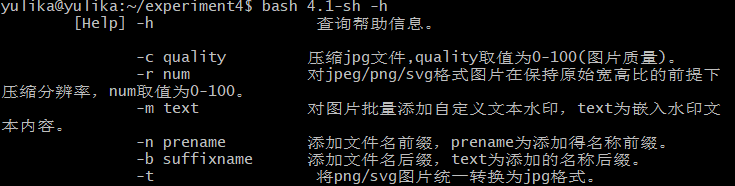

* 对jpeg格式图片进行图片质量压缩

  压缩前图像

  

  压缩后图像(采用50%的质量压缩)

  

  前后图片属性对比

  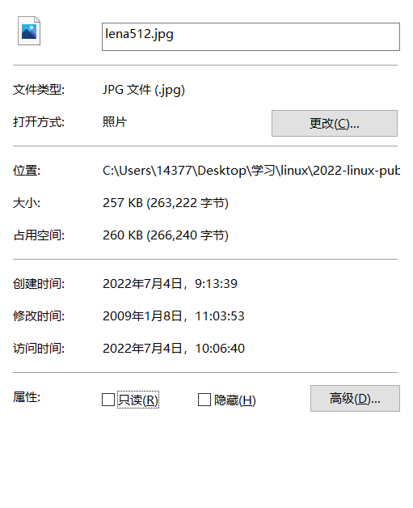

  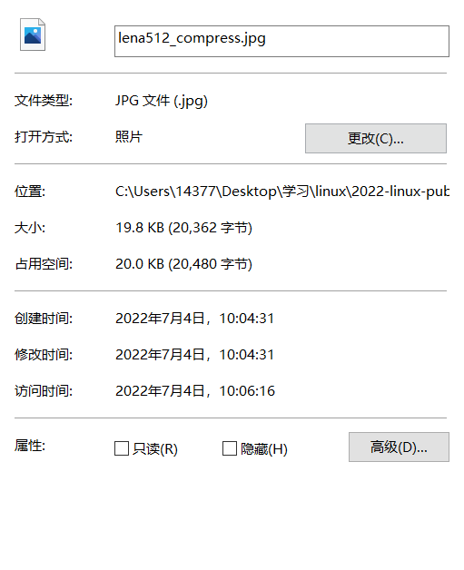

* 对jpeg/png/svg格式图片在保持原始宽高比的前提下压缩分辨率

  原图

  

  对图片进行50%分辨率压缩

  

* 对图片批量添加自定义文本水印

  对图片添加水印"Watermark"(水印位置在左上角)

  

* 批量重命名

  * 前缀

    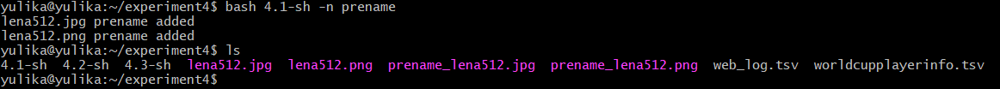

  * 后缀

    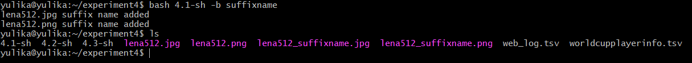

* 将png/svg图片统一转换为jpg格式图片

  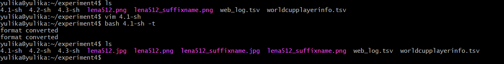

#### 任务二：用bash编写一个文本批处理脚本，对以下附件分别进行批量处理完成相应的数据统计任务：

- [2014世界杯运动员数据](http://sec.cuc.edu.cn/huangwei/course/LinuxSysAdmin/exp/chap0x04/worldcupplayerinfo.tsv)
  - 统计不同年龄区间范围（20岁以下、[20-30]、30岁以上）的球员**数量**、**百分比**
  - 统计不同场上位置的球员**数量**、**百分比**
  - 名字最长的球员是谁？名字最短的球员是谁？
  - 年龄最大的球员是谁？年龄最小的球员是谁？

​	

帮助信息如下

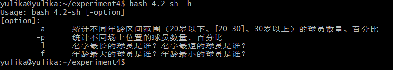

* 统计不同年龄区间范围（20岁以下、[20-30]、30岁以上）的球员**数量**、**百分比**

  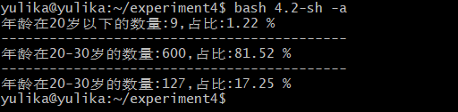

* 统计不同场上位置的球员**数量**、**百分比**

  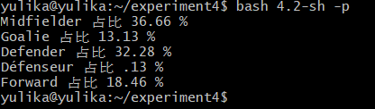

* 名字最长的球员是谁？名字最短的球员是谁？

  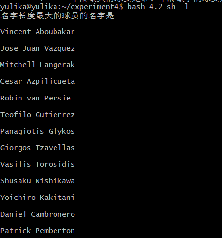

* 年龄最大的球员是谁？年龄最小的球员是谁？

  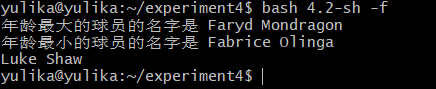

#### 任务三：用bash编写一个文本批处理脚本，对以下附件分别进行批量处理完成相应的数据统计任务：

- [Web服务器访问日志](http://sec.cuc.edu.cn/huangwei/course/LinuxSysAdmin/exp/chap0x04/web_log.tsv.7z)
  - 统计访问来源主机TOP 100和分别对应出现的总次数
  - 统计访问来源主机TOP 100 IP和分别对应出现的总次数
  - 统计最频繁被访问的URL TOP 100
  - 统计不同响应状态码的出现次数和对应百分比
  - 分别统计不同4XX状态码对应的TOP 10 URL和对应出现的总次数
  - 给定URL输出TOP 100访问来源主机

帮助信息如下：

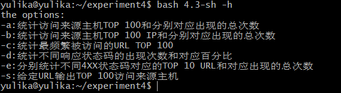

* 统计访问来源主机TOP 100和分别对应出现的总次数

  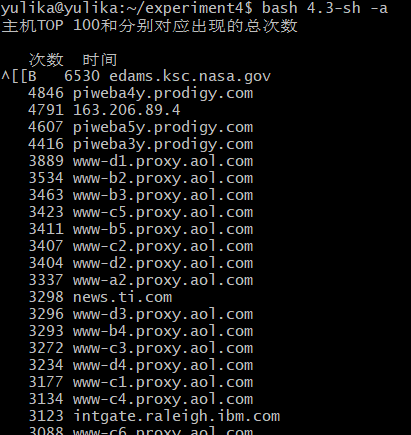

* 统计访问来源主机TOP 100 IP和分别对应出现的总次数

  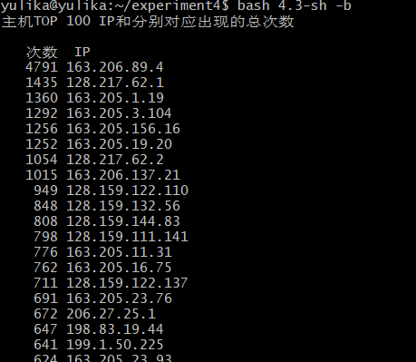

* 统计最频繁被访问的URL TOP 100

  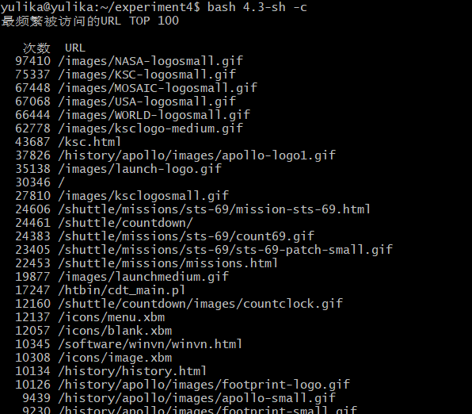

* 统计不同响应状态码的出现次数和对应百分比

  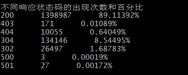

* 统计不同4XX状态码对应的TOP 10 URL和对应出现的总次数

  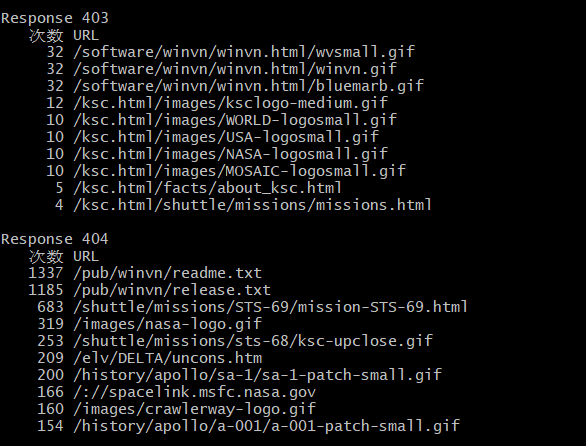

* 给定URL输出TOP 100访问来源主机

  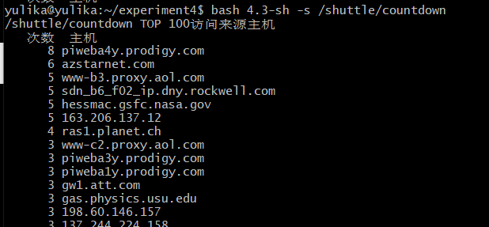