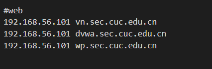
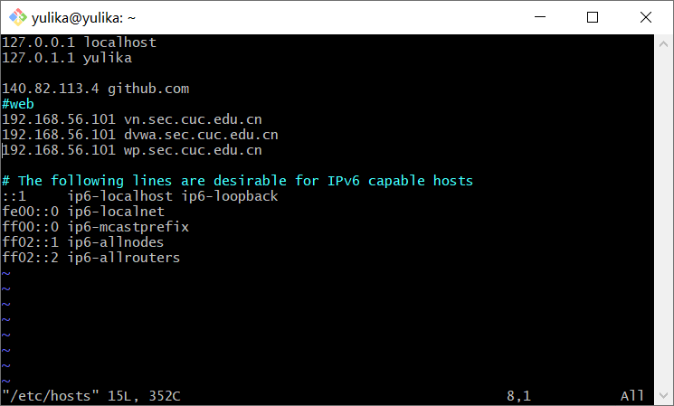
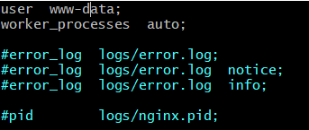
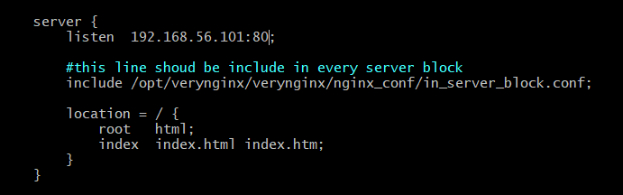
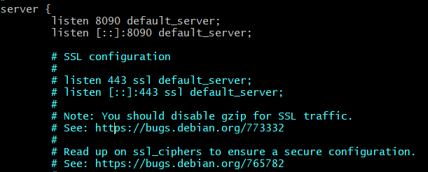
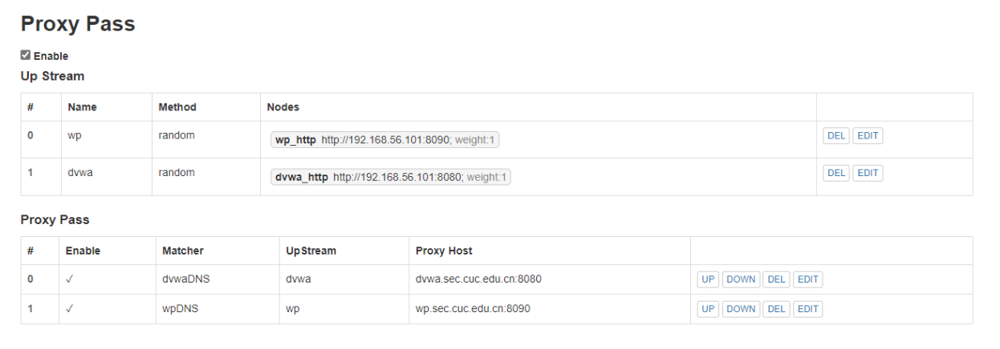

## 第五次实验

### 实验环境

## 实验环境

- Nginx
- VeryNginx
- Wordpress
- Damn Vulnerable Web Application (DVWA)
- Ubuntu 20.04

### 实验内容

#### 基本要求

* 分别在虚拟机和宿主机上配置hosts文件

  

  

* 在虚拟机上同时配置Nginx和VeryNginx

  * 安装VeryNginx

  ```
  git clone https://github.com/alexazhou/VeryNginx.git #克隆VeryNginx仓库到本地
  sudo apt-get install libpcre3 libpcre3-dev #安装libpcre3库
  sudo apt-get install libssl-dev libssl-dev #安装libssl库
  sudo apt install gcc
  sudo apt install make
  sudo apt-get install zlib1g-dev #安装zlib库
  
  cd VeryNginx
  sudo python install.py install
  ```

  * 配置VeryNginx配置文件

    ```
    sudo vim /opt/verynginx/openresty/nginx/conf/nginx.conf
    
    sudo /opt/verynginx/openresty/nginx/sbin/nginx
    ```

    并将用户改为www-data,将监听端口改为80

    

    

  * 修改Nginx配置文件，将端口号改为8090

    

  * 启动Nginx服务

    ```
    sudo service nginx start
    ```

    

  * 在宿主机中访问浏览器IP地址：`192.168.56.101:8090`，如果网页正常访问，则Nginx配置成功

* 安装wordpress

  ```
  #获取wordPress安装包
  wget https://github.com/WordPress/WordPress/archive/4.7.zip
  
  #解压文件
  unzip 4.7.zip
  ```

* PHP-FPM进程的反向代理配置

  ```
  #安装mysql
  sudo apt install mysql-server
  
  #安装php-fpm模块以及帮助程序包php-mysql
  sudo apt install php-fpm php-mysql
  
  #修改/etc/nginx/sites-enabled/default文件
  sudo vim /etc/nginx/sites-enabled/default
  
  #对Nginx配置文件做以下修改
  location ~ \.php$ {
        include snippets/fastcgi-php.conf;
         fastcgi_pass unix:/var/run/php/php7.2-fpm.sock;
    }
  
  #重新启动nginx
   sudo systemctl restart nginx
  ```

* 配置wordPress

  * 数据库配置

    ```
    mysql -u root -p
    
    #创建wordpress数据库
    CREATE DATABASE wordpress DEFAULT CHARACTER SET utf8 COLLATE utf8_unicode_ci;
    
    #创建数据库新用户
    GRANT ALL ON wordpress.* TO 'yulika'@'localhost' IDENTIFIED BY 'cuc';
    
    FLUSH PRIVILEGES;
    exit；
    ```

  * 配置php

    ```
      $ sudo apt install php-fpm php-mysql
      $ sudo apt install php-curl php-gd php-intl php-mbstring php-soap php-xml php-xmlrpc php-zip
      $ sudo systemctl restart php7.2-fpm
    ```

  * 配置wordPress

    ```
    cp WordPress-4.7/wp-config-sample.php WordPress-4.7/wp-config.php
    
    sudo cp -a WordPress-4.7/. /var/www/html/wordpress
    sudo chmod -R 777 /var/www/html/wordpress
    curl -s https://api.wordpress.org/secret-key/1.1/salt/
    #需要将生成的内容复制到/var/www/html/wordpress/wp-config.php中，并修改数据库
    ```

  * 配置nginx

    ```
    sudo vim /etc/nginx/sites-enabled/default
    #做以下修改
    root /var/www/html/wordpress;
    server_name wp.sec.cuc.edu.cn;
    
    #修改完后保存退出并重新加载nginx
    sudo systemctl reload nginx
    ```

  * 在宿主机上，通过域名http://wp.sec.cuc.edu.cn访问网站，若网站访问成功则wordpress配置成功

* 安装并配置DVWA

  * 安装DVWA

    ```
    sudo git clone https://github.com/ethicalhack3r/DVWA
    
    sudo mv /DVWA /var/www/html
    
    sudo cp /var/www/html/DVWA/config/config.inc.php.dist /var/www/html/DVWA/config/config.inc.php
    ```

  * 配置数据库

    ```
    #新建数据库DVWA和新用户
    CREATE DATABASE dvwa DEFAULT CHARACTER SET utf8 COLLATE utf8_unicode_ci;
    GRANT ALL ON dvwa.* TO 'dvwauser'@'localhost' IDENTIFIED BY 'cuc';
    FLUSH PRIVILEGES;
    EXIT;
    
    sudo systemctl restart mysql
    ```

  * 修改DWVA配置文件

    ```
    sudo vim /var/www/html/DVWA/config/config.inc.php
    sudo chown -R www-data.www-data /var/www/html/DVWA
    
    #做以下修改
    $_DVWA[ 'db_server' ]   = '127.0.0.1';
    $_DVWA[ 'db_database' ] = 'dvwa';
    $_DVWA[ 'db_user' ]     = 'dvwauser';
    $_DVWA[ 'db_password' ] = 'p@ssw0rd';
    ```

  * 配置php

    ```
    sudo vim /etc/php/7.2/fpm/php.ini
    
    #修改以下内容
    allow_url_include = on
    allow_url_fopen = on
    safe_mode = off
    magic_quotes_gpc = off
    display_errors = off
    
    #重启php-fpm
    sudo systemctl restart php7.2-fpm
    ```

  * 配置Nginx

    ```
    sudo vim /etc/nginx/sites-enabled/default
    
    #做以下修改
    server {
         listen 8080;
         listen [::]:8080;
    
         server_name dvwa.sec.cuc.edu.cn;
    
         root /var/www/html/DVWA;
         index index.html setup.php index.htm index.php index.nginx-debian.html;
         location / {
                 try_files $uri $uri/ =404;
           }
         #配置php-fpm反向代理
         location ~ \.php$ {
                 include snippets/fastcgi-php.conf;
                 fastcgi_pass unix:/var/run/php/php7.2-fpm.sock;
         }
     }
     
     #修改完毕后，重启nginx
     sudo systemctl restart nginx
    ```

  * 在宿主机上通过192.168.56.101:8090访问DVWA

* VeryNginx作为本次实验的Web App的反向代理服务器和WAF

  

  

  

​		
